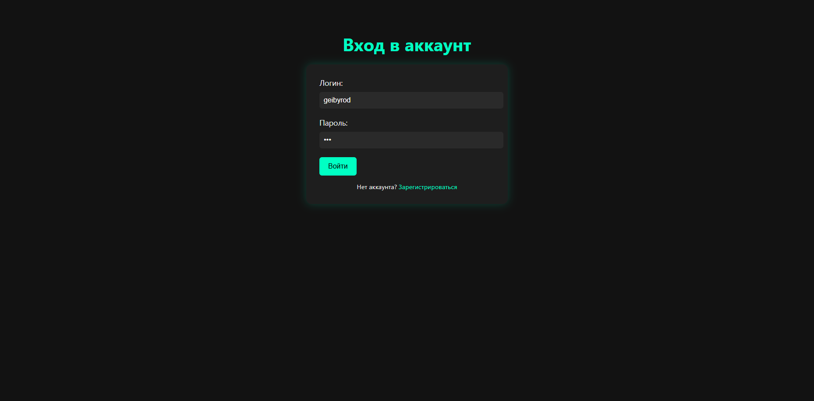
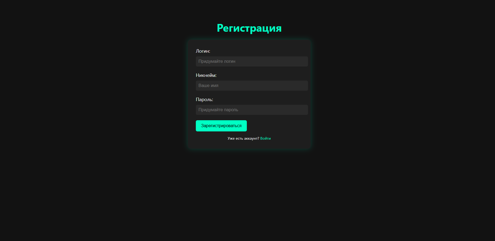
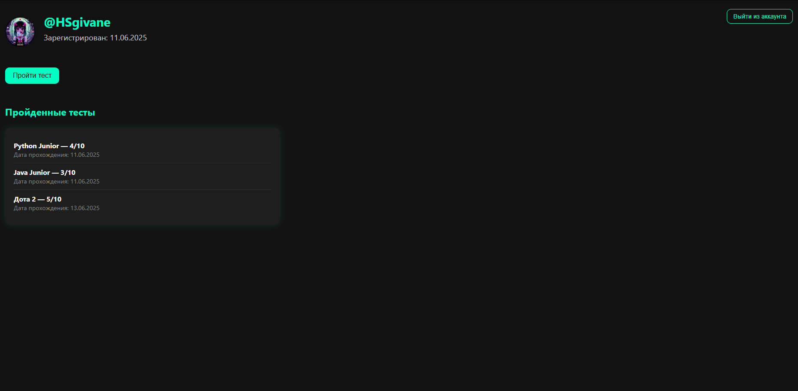
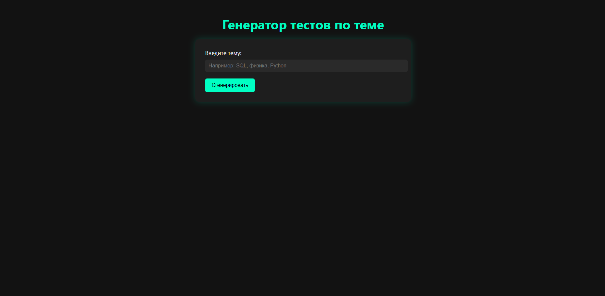
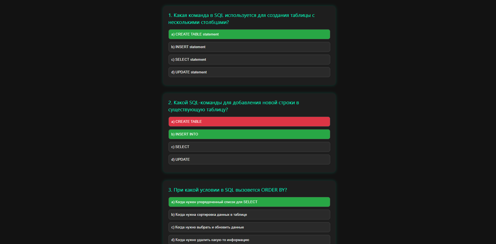
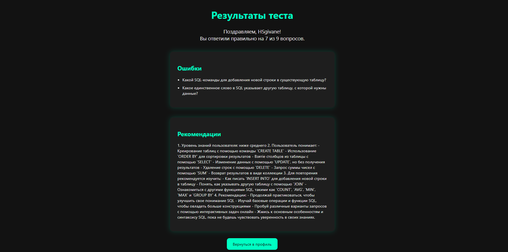

# Веб-приложение для генерации тестов.

### Запуск веб-приложения.

### 1. Клонируй проект

```bash
git clone https://github.com/HSgivane/AI_QuizWebApp
cd AI_QuizWebApp
```

### 2. Установи зависимости
```bash
pip install -r requirements.txt
```

### 3. Настройка .env
### Создай файл .env в корне проекта и добавь туда:
```
API_TOKEN='твой_API_ключ_от_OpenRouter'
SECRET_KEY='твой_SECRET_KEY_для_Flask'
```
### Создать API_ключ можно перейдя на [openrouter.ai/sign-up](https://openrouter.ai/sign-up)

### Создать SECRET_KEY можно с помощью команды:
```
python -c "import secrets; print(secrets.token_hex(32))"
```

### 4. Запусти сервер
```bash
python3 app.py
```

### 5. Перейди на http://localhost:5000 или на ту ссылку, которую выбило в консоль.

# Скрины веб-приложения

*Рисунок 1. Вход в аккаунт*


*Рисунок 2. Регистрация аккаунта*


*Рисунок 3. Профиль*


*Рисунок 3. Создание теста*


*Рисунок 3. Пример созданного теста*


*Рисунок 3. Ответ модели на решенный тест*